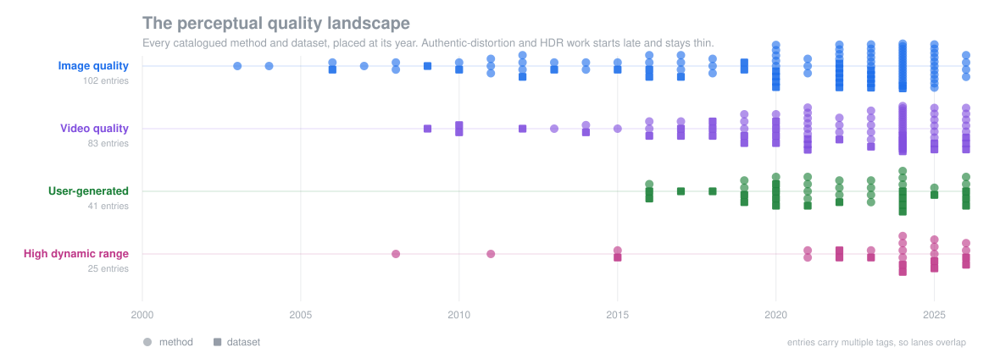

<div align="center">

# Awesome Perceptual Quality

**Metrics, models, and subjective datasets for how images and video actually look to people.**

[](https://awesome.re)


[](CONTRIBUTING.md)
[](https://github.com/shreshthsaini/Awesome-Perceptual-Quality/actions/workflows/ci.yml)
[](https://github.com/shreshthsaini/Awesome-Perceptual-Quality/actions/workflows/links.yml)



</div>

Image quality, video quality, user-generated content, and HDR, kept in one place instead of four. Datasets sit in their own tables so you can find data by what it holds rather than by which paper introduced it. Every entry is tagged along all four axes, so an HDR video model shows up whether you came looking for HDR or for video.

## Contact

Maintained by [Shreshth Saini](https://shreshthsaini.github.io). Corrections and additions are welcome through [issues](https://github.com/shreshthsaini/Awesome-Perceptual-Quality/issues) or a pull request.

If the catalog is useful in your work, a star helps others find it, and you can cite it as:

```bibtex
@misc{saini2026awesomeperceptualquality,
  title  = {Awesome Perceptual Quality: A Tagged Catalog of Image, Video, UGC and HDR Quality Assessment},
  author = {Saini, Shreshth},
  year   = {2026},
  url    = {https://github.com/shreshthsaini/Awesome-Perceptual-Quality}
}
```

## Tags

| Tag | Meaning |
| :--- | :--- |
|  | High dynamic range, wide gamut, high bit depth |
|  | User-generated content, authentic rather than simulated distortion |
|  | Video quality |
|  | Still image quality |

Modifiers narrow it further: `FR` and `NR` for reference availability, `MLLM` for language-model scorers, `AIGC` for generated content, `SYNTHETIC` and `AUTHENTIC` for how the distortion arose, plus `GAMING`, `STREAMING`, and `COMPRESSION`.

## Adding a paper

**Easiest way, no git at all:** [open an issue](https://github.com/shreshthsaini/Awesome-Perceptual-Quality/issues/new/choose), fill in the form, done. A bot builds the row, validates it, checks your links, regenerates the tables and opens the pull request for you. If something is off it says so in a comment rather than failing silently.

**Editing directly:** `README.md` is generated, so change the CSVs in `data/` instead, then run:

```bash
python3 scripts/validate.py
python3 scripts/generate_readme.py
```

Commit the CSV row and the regenerated README together. Standard library only, nothing to install.

Either way it is welcome, including your own papers. Saying you are an author just makes review faster. Conventions live in [CONTRIBUTING.md](CONTRIBUTING.md).

## Contents

- **[Datasets](#datasets)** (63)
  - [Generated content](#generated-content) (9) &nbsp;·&nbsp; diffusion and text-to-vision output
  - [HDR](#hdr) (10) &nbsp;·&nbsp; high dynamic range, wide gamut, UGC HDR
  - [Video](#video) (24) &nbsp;·&nbsp; UGC, streaming, gaming, compression
  - [Image](#image) (20) &nbsp;·&nbsp; synthetic distortion, in-the-wild, aesthetics
- **[Methods](#methods)** (113)
  - [Multimodal and reasoning](#multimodal-and-reasoning) (23) &nbsp;·&nbsp; MLLM scorers, RL-trained reasoning, benchmarks
  - [HDR](#hdr-1) (15) &nbsp;·&nbsp; PU encodings, VDP family, HDR UGC models
  - [Video](#video-1) (26) &nbsp;·&nbsp; full-reference, blind UGC, efficient samplers
  - [No-reference image](#no-reference-image) (29) &nbsp;·&nbsp; NSS, CNN, transformer, CLIP
  - [Full-reference image](#full-reference-image) (20) &nbsp;·&nbsp; classical indices, learned perceptual distances
- **[Challenges](#challenges)** (8) &nbsp;·&nbsp; NTIRE, AIM, AIS, CLIC, ICME, VQEG
- **[Surveys](#surveys)** (7)
- **[Toolboxes](#toolboxes)** (12) &nbsp;·&nbsp; pyiqa, VMAF, PIQ, ColorVideoVDP
- **[Elsewhere](#elsewhere)** &nbsp;·&nbsp; related lists

---

## Datasets

Newest first. A blank cell means the number is not reliably documented, not that it is zero.

### Generated content

Subjective data for diffusion and text-to-vision output, where the failure modes differ from camera distortion.

<!-- AUTOGEN:datasets:aigc -->
| Dataset | Content | Annotations | Venue | Tags | Links |
| :--- | :--- | :--- | :---: | :--- | :---: |
| **EvalCrafter**<br /><sub>Benchmark aligning objective metrics to human opinion</sub> | 700 prompts across several text-to-video models | human-aligned scores over 17 metrics | CVPR 2024 |  `AIGC` | [paper](https://arxiv.org/abs/2310.11440) [](https://github.com/evalcrafter/EvalCrafter) |
| **GenAI-Bench**<br /><sub>Human preference votes comparing text-to-video model outputs</sub> | video subset of GenAI-Arena outputs | 1,069 pairwise human votes | NeurIPS 2024 |  `AIGC` | [paper](https://arxiv.org/abs/2406.04485) [](https://github.com/TIGER-AI-Lab/GenAI-Bench) |
| **RichHF-18K**<br /><sub>Point-level artifact and misalignment annotations, not just a single score</sub> | 18,000 generated images | 4 fine-grained scores plus artifact heatmaps | CVPR 2024 |  `AIGC` | [paper](https://arxiv.org/abs/2312.10240) [](https://github.com/google-research-datasets/richhf-18k) |
| **T2VQA-DB**<br /><sub>Large text-to-video quality set collected under an ITU-compliant protocol</sub> | 10,000 videos from 9 text-to-video models | MOS from 27 annotators | ACMMM 2024 |  `AIGC` | [paper](https://arxiv.org/abs/2403.11956) [](https://github.com/QMME/T2VQA) |
| **VideoFeedback**<br /><sub>Quality, consistency and alignment scores; the training set behind VideoScore</sub> | about 37,600 videos from 11 generators | multi-aspect human scores, 1 to 4 | EMNLP 2024 |  `AIGC` | [paper](https://arxiv.org/abs/2406.15252) [data](https://huggingface.co/datasets/TIGER-Lab/VideoFeedback) |
| **AGIQA-1K**<br /><sub>An early perceptual quality set for generated images, from two diffusion models</sub> | 1,080 images | MOS | arXiv 2023 |  `AIGC` | [paper](https://arxiv.org/abs/2303.12618) [](https://github.com/lcysyzxdxc/AGIQA-1k-Database) |
| **AGIQA-3K**<br /><sub>Spans GAN, autoregressive and diffusion text-to-image models</sub> | 2,982 AI-generated images | 125,244 ratings, 21 raters on 2 dimensions | TCSVT 2023 |  `AIGC` | [paper](https://arxiv.org/abs/2306.04717) [](https://github.com/lcysyzxdxc/AGIQA-3k-Database) |
| **AIGCIQA2023**<br /><sub>Six text-to-image models across 100 prompts, scored on three dimensions</sub> | 2,400 images | MOS for quality, authenticity and correspondence | arXiv 2023 |  `AIGC` | [paper](https://arxiv.org/abs/2307.00211) [](https://github.com/wangjiarui153/AIGCIQA2023) |
| **PKU-I2IQA**<br /><sub>Image-to-image generation quality, Midjourney and Stable Diffusion v1.5</sub> | 1,600 images | 32,000 ratings, 20 raters | arXiv 2023 |  `AIGC` | [paper](https://arxiv.org/abs/2311.15556) [](https://github.com/jiquan123/I2IQA) |
<!-- /AUTOGEN -->

### HDR

<!-- AUTOGEN:datasets:hdr -->
| Dataset | Content | Annotations | Venue | Tags | Links |
| :--- | :--- | :--- | :---: | :--- | :---: |
| **Beyond8Bits**<br /><sub>Largest crowdsourced real-world HDR UGC quality study to date</sub> | 44K videos from 6.5K sources | over 1.5M crowd ratings | CVPR 2026 |    `AUTHENTIC` | [paper](https://arxiv.org/abs/2603.00938) [data](https://shreshthsaini.github.io/Beyond8Bits/) |
| **BrightVQ**<br /><sub>Subjective database dedicated to HDR UGC quality modelling</sub> | 300 sources, 2,100 transcoded videos | 73,794 crowd ratings | WACV 2026 |    `AUTHENTIC` | [paper](https://openaccess.thecvf.com/content/WACV2026/papers/Saini_BrightRate_Quality_Assessment_for_User-Generated_HDR_Videos_WACV_2026_paper.pdf) [](https://github.com/shreshthsaini/BrightVQ) |
| **CHUG**<br /><sub>Large-scale subjective study of real-world user-generated HDR quality</sub> | 856 UGC HDR sources, 5,992 transcoded videos | 211,848 crowdsourced ratings | ICIP 2025 |    `AUTHENTIC` | [paper](https://arxiv.org/abs/2510.09879) [](https://github.com/shreshthsaini/CHUG) |
| **HDRSDR-VQA**<br /><sub>Content-level HDR versus SDR preference measured on consumer TVs</sub> | 960 videos, 54 sources, HDR and SDR pairs | over 22,000 pairwise comparisons, 145 subjects | arXiv 2025 |   | [paper](https://arxiv.org/abs/2505.21831) [data](https://www.colorado.edu/lab/live/live-paired-comparison-hdr-vs-sdr-database) |
| **LIVE HDR-vs-SDR**<br /><sub>HDR versus SDR preference under compression and scaling across display types</sub> | 356 videos, 212 public | over 23,000 ratings, 67 subjects, 3 TV types | TIP 2024 |   `COMPRESSION` | [paper](https://doi.org/10.1109/TIP.2024.3404890) [data](https://live.ece.utexas.edu/research/LIVE_HDRvsSDR/index.html) |
| **YouTube SFV+HDR**<br /><sub>Portrait short-form HDR UGC content sourced from YouTube</sub> | 300 reference videos, Rec.2020 HDR10, portrait | subjective score availability not confirmed | ICIP 2024 |    | [paper](https://doi.org/10.1109/ICIP51287.2024.10647927) |
| **LIVE-HDR**<br /><sub>First public HDR10 video quality database, studied under two lighting conditions</sub> | 310 videos, 31 sources | about 20K ratings, 66 subjects, 2 ambient conditions | TIP 2023 |   `COMPRESSION` | [paper](https://doi.org/10.1109/TIP.2023.3333217) [data](https://live.ece.utexas.edu/research/LIVEHDR/LIVEHDR_index.html) |
| **SI-HDR**<br /><sub>Single-image HDR reconstruction benchmark used to stress-test HDR quality metrics</sub> | 181 HDR scenes, RAW stacks plus 6 reconstruction outputs | metric benchmark rather than a full MOS study | SIGGRAPH 2022 |   | [paper](https://doi.org/10.1145/3528233.3530729) [data](https://www.repository.cam.ac.uk/items/c02ccdde-db20-4acd-8941-7816ef6b7dc7) |
| **UPIQ**<br /><sub>Merges SDR and HDR databases onto one unified quality scale</sub> | 84 reference and 4,159 distorted images | MOS rescaled to an absolute photometric JOD scale | TMM 2022 |   | [paper](https://doi.org/10.1109/TMM.2021.3076298) [data](https://www.repository.cam.ac.uk/handle/1810/315373) |
| **MMSPG HDR JPEG-XT**<br /><sub>Classic HDR compression study used to calibrate PU and HDR-VDP metrics</sub> | 20 scenes, 4 bitrates, 3 JPEG-XT profiles | MOS by DSIS, 24 subjects | QoMEX 2015 |   `COMPRESSION` | [paper](https://doi.org/10.1109/QoMEX.2015.7148119) [data](https://qualinet.github.io/databases/image/mmspg_subjective_quality_assessment_database_of_hdr_images_compressed_with_jpeg_xt/) |
<!-- /AUTOGEN -->

### Video

<!-- AUTOGEN:datasets:video -->
| Dataset | Content | Annotations | Venue | Tags | Links |
| :--- | :--- | :--- | :---: | :--- | :---: |
| **GameScope**<br /><sub>Largest gaming quality set, spanning H.264, H.265 and AV1</sub> | 4,048 videos from 424 clips across 74 games | about 37 ratings per video | arXiv 2026 |   `GAMING` | [paper](https://arxiv.org/abs/2605.01272) [data](https://rajeshsureddi.github.io/GameScope/) |
| **KVQ**<br /><sub>Short-form UGC across capture, transcode and enhancement pipelines</sub> | 4,200 videos, 600 uploaded and 3,600 processed | MOS per video | CVPR 2024 |   | [paper](https://arxiv.org/abs/2402.07220) [](https://github.com/lixinustc/KVQ-Challenge-CVPR-NTIRE2024) |
| **TaoLive QoE**<br /><sub>Live-streaming QoE including frame-skip and variable-frame-rate distortion</sub> | 1,197 videos, 42 sources | subjective QoE MOS | arXiv 2024 |   `STREAMING` | [paper](https://arxiv.org/abs/2409.17596) [data](https://ieee-dataport.org/documents/taolive-qoe-database) |
| **LIVE-YT-Gaming**<br /><sub>Gaming clips with mixed capture, recording and compression distortion</sub> | 600 videos from 59 games, 360p to 1080p | 18,600 ratings, 61 subjects | arXiv 2022 |   `GAMING` | [paper](https://arxiv.org/abs/2203.12824) [data](https://live.ece.utexas.edu/research/LIVE-YT-Gaming/index.html) |
| **LIVE-NFLX-II**<br /><sub>Adaptive streaming QoE driven by real network traces and client adaptation</sub> | 420 videos, 15 contents | 9,750 continuous and 9,750 retrospective scores | TIP 2021 |  `STREAMING` `SYNTHETIC` | [paper](https://arxiv.org/abs/1808.03898) [data](https://live.ece.utexas.edu/research/LIVE_NFLX_II/live_nflx_plus.html) |
| **LIVE-YT-HFR**<br /><sub>Frame rate and compression interaction, from 24 to 120 fps</sub> | 480 videos, 16 contents, 1080p and 4K | 19,000 ratings, 85 subjects | Access 2021 |  `SYNTHETIC` | [paper](https://arxiv.org/abs/2007.11634) [data](https://live.ece.utexas.edu/research/LIVE_YT_HFR/LIVE_YT_HFR/index.html) |
| **LSVQ**<br /><sub>The largest in-the-wild UGC video quality set; underlies the PVQ models</sub> | 38,811 videos, 240p to 1080p | about 5.5M patch-level scores | CVPR 2021 |   | [paper](https://arxiv.org/abs/2011.13544) [](https://github.com/baidut/PatchVQ) |
| **BVI-DVC**<br /><sub>Video coding training set for CNN-based compression; 772 sequences released</sub> | 800 sequences, 270p to 2160p | none; a training set, no MOS | arXiv 2020 |  `COMPRESSION` `SYNTHETIC` | [paper](https://arxiv.org/abs/2003.13552) [data](https://data.bris.ac.uk/data/dataset/3h0hduxrq4awq2ffvhabjzbzi1) |
| **CGVDS**<br /><sub>Cloud-gaming encodes rated for quality, fragmentation and discontinuity</sub> | 270 videos, 480p to 1080p | MOS from over 100 subjects | MMSys 2020 |  `GAMING` `SYNTHETIC` | [paper](https://doi.org/10.1145/3339825.3391872) [](https://github.com/stootaghaj/CGVDS) |
| **UGC-VIDEO**<br /><sub>Short-form UGC re-encoded at several codecs and quantisation levels</sub> | 50 source videos plus transcoded variants | subjective MOS | MIPR 2020 |   `COMPRESSION` | [paper](https://arxiv.org/abs/1908.11517) |
| **Waterloo SQoE-IV**<br /><sub>Large adaptive-streaming QoE study across devices, encoders and algorithms</sub> | 1,350 videos | QoE 0 to 100, 92 subjects across three device classes | arXiv 2020 |  `STREAMING` `SYNTHETIC` | [paper](https://arxiv.org/abs/2008.08804) [data](https://ieee-dataport.org/open-access/waterloo-streaming-quality-experience-database-iv) |
| **LIVE-VQC**<br /><sub>Real in-capture UGC from 101 devices; the largest video study of its time</sub> | 585 videos, 240p to 1080p | over 205,000 scores from 4,776 subjects | TIP 2019 |   `AUTHENTIC` | [paper](https://arxiv.org/abs/1803.01761) [data](https://live.ece.utexas.edu/research/LIVEVQC/index.html) |
| **YouTube-UGC**<br /><sub>Creative-Commons YouTube sample built for compression and quality research</sub> | 1,500 videos, 360p to 4K, 15 categories | crowdsourced MOS from over 8,000 raters | MMSP 2019 |   `COMPRESSION` | [paper](https://arxiv.org/abs/1904.06457) [data](https://media.withyoutube.com/) |
| **GamingVideoSET**<br /><sub>Six games at three resolutions and five bitrates, H.264 encoded</sub> | 600 videos, 24 raw and 576 distorted, 1080p | subjective MOS under ITU-T P.910 | NetGames 2018 |  `GAMING` `SYNTHETIC` | [paper](https://ieeexplore.ieee.org/document/8463362/) |
| **LIVE-Qualcomm**<br /><sub>In-capture mobile distortion: focus, exposure and stabilisation failures</sub> | 208 videos from 8 devices | MOS from 39 subjects | TCSVT 2018 |   `AUTHENTIC` | [paper](https://live.ece.utexas.edu/research/incaptureDatabase/index.html) [data](https://live.ece.utexas.edu/research/incaptureDatabase/index.html) |
| **Waterloo SQoE-III**<br /><sub>Six adaptive-bitrate algorithms across 13 network conditions</sub> | 470 videos, 20 references | MOS from 34 subjects | TBC 2018 |  `STREAMING` `SYNTHETIC` | [paper](https://ieee-dataport.org/open-access/waterloo-streaming-quality-experience-database-iii) [data](https://ieee-dataport.org/open-access/waterloo-streaming-quality-experience-database-iii) |
| **KoNViD-1k**<br /><sub>Sampled from YFCC100M using six quality-diversity attributes</sub> | 1,200 videos at 960x540 | crowdsourced MOS on a 1 to 5 scale | QoMEX 2017 |   `AUTHENTIC` | [paper](https://www.uni-konstanz.de/mmsp/pubsys/publishedFiles/HoHaJe17.pdf) [data](https://database.mmsp-kn.de/konvid-1k-database.html) |
| **LIVE-NFLX-I**<br /><sub>Handcrafted compression and rebuffering playout patterns on mobile</sub> | 112 videos at 1080p | MOS from over 55 subjects | TIP 2017 |  `STREAMING` `SYNTHETIC` | [paper](https://live.ece.utexas.edu/research/LIVE_NFLXStudy/nflx_index.html) [data](https://live.ece.utexas.edu/research/LIVE_NFLXStudy/nflx_index.html) |
| **CVD2014**<br /><sub>Real camera in-capture distortion rather than synthetic post-processing</sub> | 234 videos from 78 cameras | MOS from 210 observers | TIP 2016 |   `AUTHENTIC` | [paper](https://ieeexplore.ieee.org/document/7464299/) [data](https://researchportal.helsinki.fi/en/datasets/cvd2014-a-database-for-evaluating-no-reference-video-quality-asse/) |
| **CSIQ Video**<br /><sub>Compression and transmission distortion at several severity levels</sub> | 240 videos, 12 references, 832x480 | DMOS from 35 subjects | JEI 2014 |  `SYNTHETIC` | [paper](https://doi.org/10.1117/1.JEI.23.1.013016) |
| **LIVE Mobile**<br /><sub>Mobile and tablet study of compression, packet loss, stalls and rate adaptation</sub> | 210 videos, 10 references, 720p | about 5,300 scores from over 50 subjects | JSTSP 2012 |  `SYNTHETIC` | [paper](https://live.ece.utexas.edu/research/quality/live_mobile_video.html) [data](https://live.ece.utexas.edu/research/quality/live_mobile_video.html) |
| **LIVE VQA**<br /><sub>The foundational video set: wireless, IP, MPEG-2 and H.264 distortion</sub> | 160 videos, 10 references, 768x432 | DMOS from 38 subjects | TIP 2010 |  `SYNTHETIC` | [paper](https://live.ece.utexas.edu/publications/2010/ks_tip_june10.pdf) [data](https://live.ece.utexas.edu/research/Quality/live_video.html) |
| **VQEG HD3**<br /><sub>HDTV validation set encoded between 1 and 15 Mbps</sub> | 72 videos, 9 sources, 1080i and 1080p | MOS from 24 subjects | VQEG 2010 |  `SYNTHETIC` | [paper](https://vqeg.org/projects/hdtv) [data](https://www.cdvl.org/) |
| **EPFL-PoliMI**<br /><sub>H.264 packet loss simulated over a noisy transmission channel</sub> | 156 videos, 78 CIF and 78 4CIF | MOS from 40 subjects | QoMEX 2009 |  `SYNTHETIC` | [paper](https://vqa.como.polimi.it/) [data](https://vqa.como.polimi.it/) |
<!-- /AUTOGEN -->

### Image

<!-- AUTOGEN:datasets:image -->
| Dataset | Content | Annotations | Venue | Tags | Links |
| :--- | :--- | :--- | :---: | :--- | :---: |
| **UHD-IQA**<br /><sub>Curated 4K Pixabay photos scored for aesthetic and technical quality</sub> | 6,073 UHD 4K images | 20 ratings per image, 10 expert raters | arXiv 2024 |   `AUTHENTIC` `AESTHETIC` | [paper](https://arxiv.org/abs/2406.17472) [data](https://database.mmsp-kn.de/uhd-iqa-benchmark-database.html) |
| **GFIQA-20K**<br /><sub>Large annotated face-only quality set sampled from YFCC100M</sub> | 20,000 face images | MOS | TMM 2023 |  `AUTHENTIC` | [paper](https://arxiv.org/abs/2207.04904) [](https://github.com/DSL-FIQA/DSL-FIQA) |
| **BIQ2021**<br /><sub>Mixes casual, deliberately distorted and web-sourced photographs</sub> | about 12,000 images | MOS | JEI 2022 |  `AUTHENTIC` | [paper](https://arxiv.org/abs/2202.03879) [](https://github.com/nisarahmedrana/BIQ2021) |
| **JUFE**<br /><sub>Non-uniform distortion in omnidirectional images, modelling real VR viewing</sub> | 258 reference and 1,032 distorted 360 degree images | quality scores plus gaze and head-movement data | AAAI 2022 |  `SYNTHETIC` | [paper](https://cdn.aaai.org/ojs/19937/19937-13-23950-1-2-20220628.pdf) |
| **TAD66K**<br /><sub>47 theme-specific aesthetic criteria; unusually dense per-image annotation</sub> | over 66,000 images | over 1,200 ratings per image | IJCAI 2022 |  `AESTHETIC` | [paper](https://www.ijcai.org/proceedings/2022/0132.pdf) [](https://github.com/woshidandan/TANet-image-aesthetics-and-quality-assessment) |
| **UID2021**<br /><sub>Underwater image enhancement benchmark, 6 scene types by 15 algorithms</sub> | 60 raw and 900 enhanced images | MOS by pairwise comparison, 52 observers | TOMM 2022 |  `AUTHENTIC` | [paper](https://arxiv.org/abs/2204.08813) [](https://github.com/Hou-Guojia/UID2021) |
| **KonIQ-10k**<br /><sub>Ecologically valid in-the-wild set sampled from YFCC100M</sub> | 10,073 images | 1.2M ratings from 1,459 crowd workers | TIP 2020 |   `AUTHENTIC` | [paper](https://arxiv.org/abs/1910.06180) [data](https://database.mmsp-kn.de/koniq-10k-database.html) |
| **NNID**<br /><sub>Dedicated subjective study of night-time image quality</sub> | 2,240 images across 448 scenes | MOS | TMM 2020 |  `AUTHENTIC` | [paper](https://ieeexplore.ieee.org/abstract/document/8821407) |
| **PaQ-2-PiQ**<br /><sub>Largest picture and patch quality study; maps patch quality onto whole pictures</sub> | 40,000 images and 120,000 patches | about 4M human judgements | CVPR 2020 |   `AUTHENTIC` | [paper](https://arxiv.org/abs/1912.10088) [](https://github.com/baidut/PaQ-2-PiQ) |
| **SPAQ**<br /><sub>Smartphone photographs with EXIF and brightness, contrast and noise labels</sub> | 11,125 images | MOS plus per-attribute labels | CVPR 2020 |   `AUTHENTIC` | [paper](https://openaccess.thecvf.com/content_CVPR_2020/html/Fang_Perceptual_Quality_Assessment_of_Smartphone_Photography_CVPR_2020_paper.html) [](https://github.com/h4nwei/SPAQ) |
| **KADID-10k**<br /><sub>25 distortion types at 5 levels across 7 distortion categories</sub> | 81 pristine and 10,125 distorted images | 30 ratings per image, DMOS | QoMEX 2019 |  `SYNTHETIC` | [paper](https://arxiv.org/abs/2001.08113) [data](https://database.mmsp-kn.de/kadid-10k-database.html) |
| **KADIS-700k**<br /><sub>Unlabelled companion to KADID-10k for weakly supervised pretraining</sub> | 140,000 pristine and 700,000 distorted images | none, deliberately unlabelled | QoMEX 2019 |  `SYNTHETIC` | [paper](https://arxiv.org/abs/2001.08113) [data](https://database.mmsp-kn.de/kadid-10k-database.html) |
| **Waterloo Exploration**<br /><sub>Deliberately has no MOS; tests generalisation by ranking criteria</sub> | 4,744 pristine and 94,880 distorted images | none; uses D-test, L-test and P-test instead | TIP 2017 |  `SYNTHETIC` | [paper](https://ieeexplore.ieee.org/document/7752930/) [data](https://kedema.org/project/exploration/index.html) |
| **AADB**<br /><sub>Aesthetic score alongside 11 photographer-identified attribute labels</sub> | 10,000 images | 5 raters per image plus 11 attributes | ECCV 2016 |  `AESTHETIC` | [paper](https://arxiv.org/abs/1606.01621) [](https://github.com/aimerykong/deepImageAestheticsAnalysis) |
| **CLIVE**<br /><sub>Mobile-captured authentic distortion, crowdsourced; the LIVE Challenge database</sub> | 1,162 images | MOS, about 175 raters per image | TIP 2016 |   `AUTHENTIC` | [paper](https://arxiv.org/abs/1511.02919) [data](https://live.ece.utexas.edu/research/ChallengeDB/) |
| **TID2013**<br /><sub>24 distortion types at 5 levels, from a multinational subjective study</sub> | 25 reference and 3,000 distorted images | MOS from about 524k judgements, 971 observers | SPIC 2013 |  `SYNTHETIC` | [paper](https://www.ponomarenko.info/tid2013.htm) [data](https://www.ponomarenko.info/tid2013.htm) |
| **AVA**<br /><sub>Photo-contest images with 66 semantic and 14 style tags</sub> | about 255,000 images | about 210 ratings per image | CVPR 2012 |  `AESTHETIC` | [paper](https://ieeexplore.ieee.org/document/6247954) [](https://github.com/imfing/ava_downloader) |
| **CSIQ**<br /><sub>Five distortion types including contrast decrement and pink noise</sub> | 30 reference and 866 distorted images | DMOS | JEI 2010 |  `SYNTHETIC` | [paper](https://s2.smu.edu/~eclarson/pubs/2010JEI_MAD.pdf) [data](https://qualinet.github.io/databases/image/categorical_image_quality_csiq_database/) |
| **TID2008**<br /><sub>17 distortion types at 4 levels; the predecessor to TID2013</sub> | 25 reference and 1,700 distorted images | MOS from about 256k judgements | AMR 2009 |  `SYNTHETIC` | [paper](https://www.ponomarenko.info/tid2008.htm) [data](https://www.ponomarenko.info/tid2008.htm) |
| **LIVE IQA**<br /><sub>The foundational FR-IQA benchmark: JPEG, JPEG2000, noise, blur, fast fading</sub> | 29 reference and 779 distorted images | DMOS, 20 to 25 raters per image | TIP 2006 |  `SYNTHETIC` | [paper](https://ieeexplore.ieee.org/document/1709988) [data](https://live.ece.utexas.edu/research/quality/subjective.htm) |
<!-- /AUTOGEN -->

---

## Methods

### Multimodal and reasoning

Language models scoring quality, usually with an explanation attached, and the benchmarks built to test them.

<!-- AUTOGEN:methods:mllm -->
| Method | Paper | Venue | Tags | Code |
| :--- | :--- | :---: | :--- | :---: |
| **PreResQ-R1** | [PreResQ-R1: Towards Fine-Grained Rank-and-Score Reinforcement Learning for Visual Quality Assessment](https://arxiv.org/abs/2511.05393)<br /><sub>Disentangled preference-response GRPO unifying score regression and ranking</sub> | EMNLP 2026 |   `MLLM` `RL` `REASONING` | - |
| **RALI** | [Reasoning as Representation: Rethinking Visual Reinforcement Learning in Image Quality Assessment](https://arxiv.org/abs/2510.11369)<br /><sub>Shows RL-trained IQA models convert visual features into aligned text representations</sub> | ICLR 2026 |  `MLLM` `RL` `REASONING` | [](https://github.com/xuanyuzhang21/RALI) |
| **Refine-IQA** | [Refine-IQA: Multi-Stage Reinforcement Finetuning for Perceptual Image Quality Assessment](https://arxiv.org/abs/2508.03763)<br /><sub>Multi-stage RFT with a reward-supervised think process and the Refine-Perception-20K set</sub> | AAAI 2026 |  `MLLM` `RL` `REASONING` | - |
| **VQ-Insight** | [VQ-Insight: Teaching VLMs for AI-Generated Video Quality Understanding via Progressive Visual RL](https://arxiv.org/abs/2506.18564)<br /><sub>Progressive GRPO from image scoring to generated-video quality with multi-dimensional rewards</sub> | AAAI 2026 |  `MLLM` `RL` `REASONING` `AIGC` | [](https://github.com/xuanyuzhang21/VQ-Insight) |
| **VQAThinker** | [VQAThinker: Exploring Generalizable and Explainable Video Quality Assessment via Reinforcement Learning](https://arxiv.org/abs/2508.06051)<br /><sub>GRPO reasoning framework with bell-shaped, ranking and temporal rewards</sub> | AAAI 2026 |  `MLLM` `RL` `REASONING` | [](https://github.com/clh124/VQAThinker) |
| **A-Bench** | [A-Bench: Are LMMs Masters at Evaluating AI-generated Images?](https://arxiv.org/abs/2406.03070)<br /><sub>Tests 18 LMMs on semantic understanding and quality of AI-generated images</sub> | ICLR 2025 |  `MLLM` `BENCHMARK` `AIGC` | [](https://github.com/Q-Future/A-Bench) |
| **DeQA-Score** | [Teaching Large Language Models to Regress Accurate Image Quality Scores Using Score Distribution](https://arxiv.org/abs/2501.11561)<br /><sub>Discretises score distributions into soft labels so MLLMs can regress accurate scores</sub> | CVPR 2025 |  `MLLM` | [](https://github.com/zhiyuanyou/DeQA-Score) |
| **LMM4LMM** | [LMM4LMM: Benchmarking and Evaluating Large-multimodal Image Generation with LMMs](https://arxiv.org/abs/2504.08358)<br /><sub>All-in-one LMM metric plus the EvalMi-50K benchmark for text-to-image perception</sub> | ICCV 2025 |  `MLLM` `BENCHMARK` `AIGC` | [](https://github.com/IntMeGroup/LMM4LMM) |
| **Q-Bench-Video** | [Q-Bench-Video: Benchmarking the Video Quality Understanding of LMMs](https://arxiv.org/abs/2409.20063)<br /><sub>Spans natural, generated and CG video with open-ended and pairwise quality questions</sub> | CVPR 2025 |  `MLLM` `BENCHMARK` | [](https://github.com/Q-Future/Q-Bench-Video) |
| **Q-Eval** | [Q-Eval-100K: Evaluating Visual Quality and Alignment Level for Text-to-Vision Content](https://arxiv.org/abs/2503.02357)<br /><sub>100K-instance MOS dataset and scoring model for text-to-image and text-to-video</sub> | CVPR 2025 |   `MLLM` `BENCHMARK` `AIGC` | [](https://github.com/zzc-1998/Q-Eval) |
| **Q-Insight** | [Q-Insight: Understanding Image Quality via Visual Reinforcement Learning](https://arxiv.org/abs/2503.22679)<br /><sub>GRPO jointly optimises score regression and degradation perception with reasoning traces</sub> | NeurIPS 2025 |  `MLLM` `RL` `REASONING` | [](https://github.com/bytedance/Q-Insight) |
| **Q-Ponder** | [Q-Ponder: A Unified Training Pipeline for Reasoning-based Visual Quality Assessment](https://arxiv.org/abs/2506.05384)<br /><sub>Cold-start SFT then GRPO, jointly optimising quality scoring and reasoning consistency</sub> | arXiv 2025 |   `MLLM` `RL` `REASONING` | [](https://github.com/vivoCameraResearch/Q-Ponder) |
| **VisualQuality-R1** | [VisualQuality-R1: Reasoning-Induced Image Quality Assessment via Reinforcement Learning to Rank](https://arxiv.org/abs/2505.14460)<br /><sub>GRPO with Thurstone comparative rewards; an early open reasoning NR-IQA model</sub> | NeurIPS 2025 |  `MLLM` `RL` `REASONING` | [](https://github.com/TianheWu/VisualQuality-R1) |
| **AesExpert** | [AesExpert: Towards Multi-modality Foundation Model for Image Aesthetics Perception](https://arxiv.org/abs/2404.09624)<br /><sub>AesMMIT instruction set of 409K records for aesthetic perception</sub> | ACMMM 2024 |  `MLLM` `AESTHETIC` | [](https://github.com/yipoh/AesExpert) |
| **Co-Instruct** | [Towards Open-Ended Visual Quality Comparison](https://arxiv.org/abs/2402.16641)<br /><sub>Multi-image quality comparison with MICBench; beats GPT-4V on open-ended comparison</sub> | ECCV 2024 |  `MLLM` | [](https://github.com/Q-Future/Co-Instruct) |
| **Compare2Score** | [Adaptive Image Quality Assessment via Teaching Large Multimodal Model to Compare](https://arxiv.org/abs/2405.19298)<br /><sub>Turns pairwise MOS comparisons into continuous scores by soft comparison and MAP</sub> | NeurIPS 2024 |  `MLLM` | [](https://github.com/Q-Future/Compare2Score) |
| **DepictQA** | [Depicting Beyond Scores: Advancing Image Quality Assessment through Multi-modal Language Models](https://arxiv.org/abs/2312.08962)<br /><sub>Language-based comparative and descriptive IQA rather than score-only assessment</sub> | ECCV 2024 |  `MLLM` `REASONING` | [](https://github.com/XPixelGroup/DepictQA) |
| **Q-Align** | [Q-Align: Teaching LMMs for Visual Scoring via Discrete Text-Defined Levels](https://arxiv.org/abs/2312.17090)<br /><sub>Unifies image quality, aesthetics and video scoring through text-defined rating levels</sub> | ICML 2024 |   `MLLM` | [](https://github.com/Q-Future/Q-Align) |
| **Q-Bench** | [Q-Bench: A Benchmark for General-Purpose Foundation Models on Low-level Vision](https://arxiv.org/abs/2309.14181)<br /><sub>Evaluates MLLMs on low-level perception, description and quality assessment</sub> | ICLR 2024 |   `MLLM` `BENCHMARK` | [](https://github.com/Q-Future/Q-Bench) |
| **Q-Boost** | [Q-Boost: On Visual Quality Assessment Ability of Low-level Multi-Modality Foundation Models](https://arxiv.org/abs/2312.15300)<br /><sub>Triadic-tone prompting and multi-prompt ensembling to lift MLLM scoring accuracy</sub> | ICMEW 2024 |   `MLLM` | - |
| **Q-Ground** | [Q-Ground: Image Quality Grounding with Large Multi-modality Models](https://arxiv.org/abs/2407.17035)<br /><sub>Fine-grained quality grounding over image, text and distortion-mask triplets</sub> | ACMMM 2024 |  `MLLM` `REASONING` | [](https://github.com/Q-Future/Q-Ground) |
| **Q-Instruct** | [Q-Instruct: Improving Low-level Visual Abilities for Multi-modality Foundation Models](https://arxiv.org/abs/2311.06783)<br /><sub>200K instruction-tuning set built from 58K human low-level visual feedback records</sub> | CVPR 2024 |   `MLLM` | [](https://github.com/Q-Future/Q-Instruct) |
| **VideoScore** | [VideoScore: Building Automatic Metrics to Simulate Fine-grained Human Feedback for Video Generation](https://arxiv.org/abs/2406.15252)<br /><sub>VideoFeedback set of 37.6K videos; reports 77.1 Spearman correlation with humans</sub> | EMNLP 2024 |  `MLLM` `BENCHMARK` `AIGC` | [](https://github.com/TIGER-AI-Lab/VideoScore) |
<!-- /AUTOGEN -->

### HDR

Luminance range and bit depth change what the distortions look like, so SDR metrics transfer badly.

<!-- AUTOGEN:methods:hdr -->
| Method | Paper | Venue | Tags | Code |
| :--- | :--- | :---: | :--- | :---: |
| **BrightRate** | [BrightRate: Quality Assessment for User-Generated HDR Videos](https://openaccess.thecvf.com/content/WACV2026/papers/Saini_BrightRate_Quality_Assessment_for_User-Generated_HDR_Videos_WACV_2026_paper.pdf)<br /><sub>CONTRIQUE, CLIP and HDR luminance features regressed to MOS for UGC HDR video</sub> | WACV 2026 |    `NR` `DEEP` | [](https://github.com/shreshthsaini/BrightVQ) |
| **HDR-Q** | [Seeing Beyond 8bits: Subjective and Objective Quality Assessment of HDR-UGC Videos](https://arxiv.org/abs/2603.00938)<br /><sub>First multimodal-LLM no-reference quality model for HDR user-generated video</sub> | CVPR 2026 |    `NR` `MLLM` `DEEP` | [](https://github.com/shreshthsaini/Beyond8Bits) |
| **Blind HDR-IQA** | [Blind HDR Image Quality Assessment Based on Aggregating Perception and Inference Features](https://doi.org/10.1038/s41598-025-94005-1)<br /><sub>Multi-scale Retinex perceptual features fused with VGG16 deep features</sub> | Sci Rep 2025 |   `NR` `DEEP` | - |
| **CompressedVQA-HDR** | [CompressedVQA-HDR: Generalized Full-Reference and No-Reference Quality Assessment Models for Compressed HDR Videos](https://arxiv.org/abs/2507.11900)<br /><sub>Swin-Transformer FR and SigLip2 NR models; won the ICME 2025 HDR/SDR challenge FR track</sub> | ICMEW 2025 |   `FR` `NR` `DEEP` `COMPRESSION` | [](https://github.com/sunwei925/CompressedVQA-HDR) |
| **Cut-FUNQUE** | [Cut-FUNQUE: An Objective Quality Model for Compressed Tone-Mapped HDR Videos](https://arxiv.org/abs/2404.13452)<br /><sub>Extends FUNQUE to compressed, tone-mapped HDR video pipelines</sub> | SPIC 2025 |   `FR` `CLASSICAL` `COMPRESSION` | - |
| **ColorVideoVDP** | [ColorVideoVDP: A Visual Difference Predictor for Image, Video and Display Distortions](https://doi.org/10.1145/3658144)<br /><sub>Chromatic and achromatic spatiotemporal metric covering HDR and AR/VR display distortions</sub> | TOG 2024 |    `FR` `CLASSICAL` | [](https://github.com/gfxdisp/ColorVideoVDP) |
| **FUNQUE+** | [A FUNQUE Approach to the Quality Assessment of Compressed HDR Videos](https://arxiv.org/abs/2312.08524)<br /><sub>Wavelet-domain shared-feature framework, more accurate and cheaper than VMAF on HDR</sub> | PCS 2024 |   `FR` `CLASSICAL` `COMPRESSION` | - |
| **HDR-ChipQA** | [HDR-ChipQA: No-Reference Quality Assessment on High Dynamic Range Videos](https://doi.org/10.1016/j.image.2024.117191)<br /><sub>NSS space-time chips with an expansive nonlinearity that emphasises luminance extremes</sub> | SPIC 2024 |   `NR` `CLASSICAL` | - |
| **HIDRO-VQA** | [HIDRO-VQA: High Dynamic Range Oracle for Video Quality Assessment](https://arxiv.org/abs/2311.11059)<br /><sub>Self-supervised contrastive fine-tuning transfers SDR quality features into the HDR domain</sub> | WACVW 2024 |   `NR` `DEEP` | [](https://github.com/avinabsaha/HIDRO-VQA) |
| **HDR-VDP-3** | [HDR-VDP-3: A Multi-Metric for Predicting Image Differences, Quality and Contrast Distortions in High Dynamic Range and Regular Content](https://arxiv.org/abs/2304.13625)<br /><sub>Unified visibility, quality and contrast-distortion metric spanning HDR and SDR</sub> | arXiv 2023 |    `FR` `CLASSICAL` | [link](https://sourceforge.net/projects/hdrvdp/) |
| **FovVideoVDP** | [FovVideoVDP: A Visible Difference Predictor for Wide Field-of-View Video](https://doi.org/10.1145/3450626.3459831)<br /><sub>Foveated spatio-temporal CSF metric for wide field-of-view, HDR and VR displays</sub> | TOG 2021 |   `FR` `CLASSICAL` | [](https://github.com/gfxdisp/FovVideoVDP) |
| **PU21** | [PU21: A Novel Perceptually Uniform Encoding for Adapting Existing Quality Metrics for HDR](https://doi.org/10.1109/PCS50896.2021.9477471)<br /><sub>Revised PU encoding fit to 10,000 cd/m2, underlying PU-PSNR, PU-SSIM and PU-FSIM</sub> | PCS 2021 |   `FR` `PU` `CLASSICAL` | [](https://github.com/gfxdisp/pu21) |
| **HDR-VQM** | [HDR-VQM: An Objective Quality Measure for High Dynamic Range Video](https://doi.org/10.1016/j.image.2015.04.009)<br /><sub>Spatio-temporal frequency decomposition; one of the first HDR video quality measures</sub> | SPIC 2015 |   `FR` `CLASSICAL` | [](https://github.com/mperreir/HDR-VQM) |
| **HDR-VDP-2** | [HDR-VDP-2: A Calibrated Visual Metric for Visibility and Quality Predictions in All Luminance Conditions](https://doi.org/10.1145/1964921.1964935)<br /><sub>Visual-system model calibrated across the luminance range, predicting visibility and quality</sub> | TOG 2011 |   `FR` `CLASSICAL` | [link](https://sourceforge.net/projects/hdrvdp/) |
| **PU encoding** | [Extending Quality Metrics to Full Luminance Range Images](https://doi.org/10.1117/12.765095)<br /><sub>The original perceptually uniform encoding that lets PSNR and SSIM run on HDR luminance</sub> | HVEI 2008 |   `FR` `PU` `CLASSICAL` | - |
<!-- /AUTOGEN -->

### Video

Temporal quality, including the UGC case where authentic distortions stack on top of each other.

<!-- AUTOGEN:methods:vqa -->
| Method | Paper | Venue | Tags | Code |
| :--- | :--- | :---: | :--- | :---: |
| **FineVQ** | [FineVQ: Fine-Grained User Generated Content Video Quality Assessment](https://arxiv.org/abs/2412.19238)<br /><sub>Fine-grained UGC scoring across multiple dimensions with quality-aware LMM reasoning</sub> | CVPR 2025 |   `NR` `DEEP` `MLLM` | [](https://github.com/IntMeGroup/FineVQ) |
| **KSVQE** | [KVQ: Kwai Video Quality Assessment for Short-form Videos](https://arxiv.org/abs/2402.07220)<br /><sub>Short-form UGC scoring with CLIP-based content and distortion understanding</sub> | CVPR 2024 |   `NR` `DEEP` | - |
| **MinimalisticVQA** | [Analysis of Video Quality Datasets via Design of Minimalistic Video Quality Models](https://arxiv.org/abs/2307.13981)<br /><sub>Probes dataset bias using deliberately bare-bones models built from minimal parts</sub> | TPAMI 2024 |   `NR` `DEEP` | [](https://github.com/sunwei925/MinimalisticVQA) |
| **ModularBVQA** | [Modular Blind Video Quality Assessment](https://arxiv.org/abs/2402.19276)<br /><sub>Modular design that explicitly models resolution and frame-rate sensitivity</sub> | CVPR 2024 |   `NR` `DEEP` | [](https://github.com/winwinwenwen77/ModularBVQA) |
| **T2VQA** | [Subjective-Aligned Dataset and Metric for Text-to-Video Quality Assessment](https://arxiv.org/abs/2403.11956)<br /><sub>Text-to-video quality metric trained on the 10K-video T2VQA-DB</sub> | ACMMM 2024 |  `NR` `DEEP` `AIGC` | [](https://github.com/QMME/T2VQA) |
| **Ada-DQA** | [Ada-DQA: Adaptive Diverse Quality-aware Feature Acquisition for Video Quality Assessment](https://arxiv.org/abs/2308.00729)<br /><sub>Adaptively pools diverse quality-aware features from frozen pretrained backbones</sub> | ACMMM 2023 |   `NR` `DEEP` | - |
| **DOVER** | [Exploring Video Quality Assessment on User Generated Contents from Aesthetic and Technical Perspectives](https://arxiv.org/abs/2211.04894)<br /><sub>Separates aesthetic from technical quality, with the DIVIDE-3k database</sub> | ICCV 2023 |   `NR` `DEEP` `AESTHETIC` | [](https://github.com/VQAssessment/DOVER) |
| **FasterVQA** | [Neighbourhood Representative Sampling for Efficient End-to-end Video Quality Assessment](https://arxiv.org/abs/2210.05357)<br /><sub>Extends FAST-VQA with spatial-temporal grid sampling for a large efficiency gain</sub> | TPAMI 2023 |   `NR` `DEEP` | [](https://github.com/VQAssessment/FAST-VQA-and-FasterVQA) |
| **Zoom-VQA** | [Zoom-VQA: Patches, Frames and Clips Integration for Video Quality Assessment](https://arxiv.org/abs/2304.06440)<br /><sub>Integrates patch, frame and clip levels; second place in the NTIRE 2023 challenge</sub> | CVPRW 2023 |   `NR` `DEEP` | [](https://github.com/k-zha14/Zoom-VQA) |
| **BVQA-PT** | [Blindly Assess Quality of In-the-Wild Videos via Quality-aware Pre-training and Motion Perception](https://arxiv.org/abs/2108.08505)<br /><sub>Transfers IQA pretraining and action-recognition motion features into blind VQA</sub> | TCSVT 2022 |   `NR` `DEEP` | [](https://github.com/zwx8981/TCSVT-2022-BVQA) |
| **FAST-VQA** | [FAST-VQA: Efficient End-to-end Video Quality Assessment with Fragment Sampling](https://arxiv.org/abs/2207.02595)<br /><sub>Fragment-sampling transformer that cuts compute by orders of magnitude</sub> | ECCV 2022 |   `NR` `DEEP` `TRANSFORMER` | [](https://github.com/VQAssessment/FAST-VQA-and-FasterVQA) |
| **SimpleVQA** | [A Deep Learning based No-reference Quality Assessment Model for UGC Videos](https://arxiv.org/abs/2204.14047)<br /><sub>End-to-end spatial features plus low-resolution motion, deliberately minimal</sub> | ACMMM 2022 |   `NR` `DEEP` | [](https://github.com/sunwei925/SimpleVQA) |
| **MDTVSFA** | [Unified Quality Assessment of In-the-Wild Videos with Mixed Datasets Training](https://arxiv.org/abs/2011.04263)<br /><sub>Mixed-dataset training with perceptual scale alignment across four UGC databases</sub> | IJCV 2021 |   `NR` `DEEP` | [](https://github.com/lidq92/MDTVSFA) |
| **PVQ** | [Patch-VQ: Patching Up the Video Quality Problem](https://arxiv.org/abs/2011.13544)<br /><sub>Local-to-global space-time patch model trained on the LSVQ database</sub> | CVPR 2021 |   `NR` `DEEP` | [](https://github.com/baidut/PatchVQ) |
| **RAPIQUE** | [RAPIQUE: Rapid and Accurate Video Quality Prediction of User Generated Content](https://arxiv.org/abs/2101.10955)<br /><sub>Pairs quality-aware scene statistics with CNN semantics for fast UGC scoring</sub> | OJSP 2021 |   `NR` `CLASSICAL` `DEEP` | [](https://github.com/vztu/RAPIQUE) |
| **ST-GREED** | [ST-GREED: Space-Time Generalized Entropic Differences for Frame Rate Dependent Video Quality Prediction](https://arxiv.org/abs/2010.13715)<br /><sub>Entropic model capturing how frame rate and compression interact in high-frame-rate video</sub> | TIP 2021 |  `FR` `CLASSICAL` | [](https://github.com/utlive/GREED) |
| **VIDEVAL** | [UGC-VQA: Benchmarking Blind Video Quality Assessment for User Generated Content](https://arxiv.org/abs/2005.14354)<br /><sub>Feature-selected fusion of 60 handcrafted features, plus a UGC benchmarking study</sub> | TIP 2021 |   `NR` `CLASSICAL` | [](https://github.com/vztu/VIDEVAL) |
| **CNN-TLVQM** | [Blind Natural Video Quality Prediction via Statistical Temporal Features and Deep Spatial Features](https://doi.org/10.1145/3394171.3413845)<br /><sub>Hybrid of handcrafted temporal statistics and deep spatial CNN features</sub> | ACMMM 2020 |   `NR` `CLASSICAL` `DEEP` | [](https://github.com/jarikorhonen/cnn-tlvqm) |
| **ST-VMAF** | [Spatiotemporal Feature Integration and Model Fusion for Full Reference Video Quality Assessment](https://arxiv.org/abs/1804.04813)<br /><sub>Spatiotemporal and ensemble VMAF extensions adding temporal features to the fusion</sub> | TCSVT 2019 |  `FR` `DEEP` | [](https://github.com/Netflix/vmaf) |
| **TLVQM** | [Two-Level Approach for No-Reference Consumer Video Quality Assessment](https://doi.org/10.1109/TIP.2019.2923051)<br /><sub>Two-layer low and high complexity features aimed at consumer capture artefacts</sub> | TIP 2019 |   `NR` `CLASSICAL` | [](https://github.com/jarikorhonen/nr-vqa-consumervideo) |
| **VSFA** | [Quality Assessment of In-the-Wild Videos](https://arxiv.org/abs/1908.00375)<br /><sub>Content-aware CNN features with GRU temporal pooling and a hysteresis model</sub> | ACMMM 2019 |   `NR` `DEEP` | [](https://github.com/lidq92/VSFA) |
| **SpEED-QA** | [SpEED-QA: Spatial Efficient Entropic Differencing for Image and Video Quality](https://doi.org/10.1109/LSP.2017.2726542)<br /><sub>Spatial-domain entropic differencing, far cheaper than ST-RRED</sub> | SPL 2017 |  `FR` `RR` `CLASSICAL` | [](https://github.com/utlive/SpEED) |
| **VIIDEO** | [A Completely Blind Video Integrity Oracle](https://live.ece.utexas.edu/publications/2016/07332944.pdf)<br /><sub>Opinion- and distortion-unaware, using only intrinsic statistical regularities</sub> | TIP 2016 |   `NR` `CLASSICAL` | [](https://github.com/utlive/VIIDEO) |
| **VMAF** | [Toward A Practical Perceptual Video Quality Metric](https://netflixtechblog.com/toward-a-practical-perceptual-video-quality-metric-653f208b9652)<br /><sub>Fusion-based full-reference metric; the de facto industry standard for streaming</sub> | Netflix 2016 |  `FR` `DEEP` `COMPRESSION` | [](https://github.com/Netflix/vmaf) |
| **V-BLIINDS** | [Blind Prediction of Natural Video Quality](https://doi.org/10.1109/TIP.2014.2299154)<br /><sub>DCT-domain spatiotemporal statistics with a motion coherence model</sub> | TIP 2014 |  `NR` `CLASSICAL` | [](https://github.com/utlive/VideoBLIINDS) |
| **ST-RRED** | [Video Quality Assessment by Reduced Reference Spatio-Temporal Entropic Differencing](https://doi.org/10.1109/TCSVT.2012.2214933)<br /><sub>Entropic differencing of spatial and temporal wavelet coefficients</sub> | TCSVT 2013 |  `FR` `RR` `CLASSICAL` | [](https://github.com/utlive/strred) |
<!-- /AUTOGEN -->

### No-reference image

Blind scoring, which is what most deployments need since the reference is rarely there.

<!-- AUTOGEN:methods:nr-iqa -->
| Method | Paper | Venue | Tags | Code |
| :--- | :--- | :---: | :--- | :---: |
| **FGResQ** | [Fine-grained Image Quality Assessment for Perceptual Image Restoration](https://arxiv.org/abs/2508.14475)<br /><sub>Fine-grained NR-IQA model with the FGRestore dataset, targeting restored-image quality</sub> | AAAI 2026 |  `NR` `DEEP` | [](https://github.com/sxfly99/FGResQ) |
| **ARNIQA** | [ARNIQA: Learning Distortion Manifold for Image Quality Assessment](https://arxiv.org/abs/2310.14918)<br /><sub>Self-supervised contrastive encoder learns a distortion manifold for blind scoring</sub> | WACV 2024 |  `NR` `DEEP` | [](https://github.com/miccunifi/ARNIQA) |
| **BIQA-CL** | [Task-Specific Normalization for Continual Learning of Blind Image Quality Models](https://arxiv.org/abs/2102.09717)<br /><sub>Continual learning across IQA datasets via task-specific batch normalisation</sub> | TIP 2024 |  `NR` `DEEP` | [](https://github.com/zwx8981/BIQA_CL) |
| **GRepQ** | [Learning Generalizable Perceptual Representations for Data-Efficient No-Reference IQA](https://arxiv.org/abs/2312.04838)<br /><sub>Self-supervised CLIP encoders contrast quality groups for few-shot NR-IQA</sub> | WACV 2024 |  `NR` `CLIP` | [](https://github.com/suhas-srinath/GRepQ) |
| **QCN** | [Blind Image Quality Assessment Based on Geometric Order Learning](https://openaccess.thecvf.com/content/CVPR2024/papers/Shin_Blind_Image_Quality_Assessment_Based_on_Geometric_Order_Learning_CVPR_2024_paper.pdf)<br /><sub>Orders feature vectors by quality using comparison transformers and learned score pivots</sub> | CVPR 2024 |  `NR` `DEEP` `TRANSFORMER` | [](https://github.com/nhshin-mcl/QCN) |
| **QualiCLIP** | [Quality-Aware Image-Text Alignment for Opinion-Unaware Image Quality Assessment](https://arxiv.org/abs/2403.11176)<br /><sub>Quality-aware CLIP fine-tuning with antonym prompts, needs no MOS labels</sub> | arXiv 2024 |  `NR` `CLIP` | [](https://github.com/miccunifi/QualiCLIP) |
| **TOPIQ** | [TOPIQ: A Top-Down Approach From Semantics to Distortions for Image Quality Assessment](https://arxiv.org/abs/2308.03060)<br /><sub>Semantic attention guides distortion localisation; ships both FR and NR variants</sub> | TIP 2024 |  `NR` `FR` `DEEP` `TRANSFORMER` | [](https://github.com/chaofengc/IQA-PyTorch) |
| **CLIP-IQA** | [Exploring CLIP for Assessing the Look and Feel of Images](https://arxiv.org/abs/2207.12396)<br /><sub>Zero-shot quality and abstract-perception scoring via CLIP antonym prompt pairs</sub> | AAAI 2023 |  `NR` `CLIP` | [](https://github.com/IceClear/CLIP-IQA) |
| **DEIQT** | [Data-Efficient Image Quality Assessment with Attention-Panel Decoder](https://arxiv.org/abs/2304.04952)<br /><sub>Transformer attention-panel decoder reaches strong accuracy from limited labels</sub> | AAAI 2023 |  `NR` `DEEP` `TRANSFORMER` | [](https://github.com/narthchin/DEIQT) |
| **LIQE** | [Blind Image Quality Assessment via Vision-Language Correspondence: A Multitask Learning Perspective](https://arxiv.org/abs/2303.14968)<br /><sub>Multitask CLIP correspondence across scene, distortion and quality-level text prompts</sub> | CVPR 2023 |  `NR` `CLIP` `TRANSFORMER` | [](https://github.com/zwx8981/LIQE) |
| **Re-IQA** | [Re-IQA: Unsupervised Learning for Image Quality Assessment in the Wild](https://arxiv.org/abs/2304.00451)<br /><sub>Dual contrastive encoders separate content from quality-aware unsupervised features</sub> | CVPR 2023 |  `NR` `DEEP` | [](https://github.com/avinabsaha/ReIQA) |
| **CONTRIQUE** | [Image Quality Assessment Using Contrastive Learning](https://arxiv.org/abs/2110.13266)<br /><sub>Contrastive pretraining predicts distortion type and degree, then linear-maps to quality</sub> | TIP 2022 |  `NR` `DEEP` | [](https://github.com/pavancm/CONTRIQUE) |
| **MANIQA** | [MANIQA: Multi-dimension Attention Network for No-Reference Image Quality Assessment](https://arxiv.org/abs/2204.08958)<br /><sub>ViT features with channel and spatial attention; won the NTIRE 2022 NR track</sub> | CVPRW 2022 |  `NR` `DEEP` `TRANSFORMER` | [](https://github.com/IIGROUP/MANIQA) |
| **TReS** | [No-Reference Image Quality Assessment via Transformers, Relative Ranking, and Self-Consistency](https://arxiv.org/abs/2108.06858)<br /><sub>CNN and transformer branches with relative-ranking and self-consistency losses</sub> | WACV 2022 |  `NR` `DEEP` `TRANSFORMER` | [](https://github.com/isalirezag/TReS) |
| **MUSIQ** | [MUSIQ: Multi-scale Image Quality Transformer](https://arxiv.org/abs/2108.05997)<br /><sub>Multi-scale transformer handles native resolution and aspect ratio without cropping</sub> | ICCV 2021 |  `NR` `DEEP` `TRANSFORMER` | [](https://github.com/google-research/google-research/tree/master/musiq) |
| **UNIQUE** | [Uncertainty-Aware Blind Image Quality Assessment in the Laboratory and Wild](https://arxiv.org/abs/2005.13983)<br /><sub>Unified model trained across several IQA datasets with pairwise learning and uncertainty</sub> | TIP 2021 |  `NR` `DEEP` | [](https://github.com/zwx8981/UNIQUE) |
| **DBCNN** | [Blind Image Quality Assessment Using a Deep Bilinear Convolutional Neural Network](https://arxiv.org/abs/1907.02665)<br /><sub>Bilinear pooling fuses synthetic-distortion and authentic-distortion CNN features</sub> | TCSVT 2020 |  `NR` `DEEP` | [](https://github.com/zwx8981/DBCNN-PyTorch) |
| **HyperIQA** | [Blindly Assess Image Quality in the Wild Guided by a Self-Adaptive Hyper Network](https://openaccess.thecvf.com/content_CVPR_2020/papers/Su_Blindly_Assess_Image_Quality_in_the_Wild_Guided_by_a_CVPR_2020_paper.pdf)<br /><sub>Hypernetwork generates content-adaptive perception rules for authentic distortion</sub> | CVPR 2020 |  `NR` `DEEP` | [](https://github.com/SSL92/hyperIQA) |
| **MetaIQA** | [MetaIQA: Deep Meta-Learning for No-Reference Image Quality Assessment](https://arxiv.org/abs/2004.05508)<br /><sub>Meta-learns a shared distortion prior, then fast-adapts to unseen distortion types</sub> | CVPR 2020 |  `NR` `DEEP` | [](https://github.com/zhuhancheng/MetaIQA) |
| **PaQ-2-PiQ** | [From Patches to Pictures (PaQ-2-PiQ): Mapping the Perceptual Space of Picture Quality](https://arxiv.org/abs/1912.10088)<br /><sub>Region-based model trained on 40K real images with 4M patch quality judgements</sub> | CVPR 2020 |  `NR` `DEEP` `AUTHENTIC` | [](https://github.com/baidut/PaQ-2-PiQ) |
| **FRIQUEE** | [Perceptual Quality Prediction on Authentically Distorted Images Using a Bag of Features Approach](https://arxiv.org/abs/1609.04757)<br /><sub>A large bag of NSS features across colour spaces, aimed at authentic camera distortion</sub> | JoV 2017 |  `NR` `CLASSICAL` `AUTHENTIC` | [](https://github.com/utlive/FRIQUEE) |
| **RankIQA** | [RankIQA: Learning from Rankings for No-Reference Image Quality Assessment](https://arxiv.org/abs/1707.08347)<br /><sub>Pretrains a Siamese ranking network on synthetically ordered distortion pairs</sub> | ICCV 2017 |  `NR` `DEEP` | [](https://github.com/xialeiliu/RankIQA) |
| **HOSA** | [Blind Image Quality Assessment Based on High Order Statistics Aggregation](https://doi.org/10.1109/TIP.2016.2585880)<br /><sub>Small codebook with soft-assigned mean, variance and skewness aggregation</sub> | TIP 2016 |  `NR` `CLASSICAL` | - |
| **IL-NIQE** | [A Feature-Enriched Completely Blind Image Quality Evaluator](https://www4.comp.polyu.edu.hk/~cslzhang/paper/IL-NIQE.pdf)<br /><sub>Opinion-unaware model adding gradient, colour and log-Gabor statistics to NIQE</sub> | TIP 2015 |  `NR` `CLASSICAL` | [link](https://www4.comp.polyu.edu.hk/~cslzhang/IQA/ILNIQE/ILNIQE.htm) |
| **NIQE** | [Making a Completely Blind Image Quality Analyzer](https://live.ece.utexas.edu/research/Quality/niqe_spl.pdf)<br /><sub>Opinion- and distortion-unaware: needs no human ratings and no distorted training images</sub> | SPL 2013 |  `NR` `CLASSICAL` | [](https://github.com/utlive/niqe) |
| **BLIINDS-II** | [Blind Image Quality Assessment: A Natural Scene Statistics Approach in the DCT Domain](https://live.ece.utexas.edu/publications/2012/saad_2012_tip.pdf)<br /><sub>NSS model of local DCT coefficients with a simple probabilistic quality predictor</sub> | TIP 2012 |  `NR` `CLASSICAL` | [](https://github.com/utlive/BLIINDS2) |
| **BRISQUE** | [No-Reference Image Quality Assessment in the Spatial Domain](https://live.ece.utexas.edu/publications/2012/TIP%20BRISQUE.pdf)<br /><sub>Spatial-domain NSS features from locally normalised luminance, no transform required</sub> | TIP 2012 |  `NR` `CLASSICAL` | [](https://github.com/utlive/BRISQUE) |
| **CORNIA** | [Unsupervised Feature Learning Framework for No-Reference Image Quality Assessment](https://doi.org/10.1109/CVPR.2012.6247789)<br /><sub>Codebook learned from raw patches by k-means, soft-assignment encoding, max pooling</sub> | CVPR 2012 |  `NR` `CLASSICAL` | [](https://github.com/HuiZeng/BIQA_Toolbox) |
| **DIIVINE** | [Blind Image Quality Assessment: From Natural Scene Statistics to Perceptual Quality](https://live.ece.utexas.edu/publications/2011/moorthy_tip_2011.pdf)<br /><sub>Two stages: identify the distortion type, then apply distortion-specific scoring</sub> | TIP 2011 |  `NR` `CLASSICAL` | [](https://github.com/utlive/DIIVINE) |
<!-- /AUTOGEN -->

### Full-reference image

<!-- AUTOGEN:methods:fr-iqa -->
| Method | Paper | Venue | Tags | Code |
| :--- | :--- | :---: | :--- | :---: |
| **A-FINE** | [Toward Generalized Image Quality Assessment: Relaxing the Perfect Reference Quality Assumption](https://arxiv.org/abs/2503.11221)<br /><sub>Adaptively blends fidelity and naturalness so the reference need not be flawless</sub> | CVPR 2025 |  `FR` `DEEP` | [](https://github.com/ChrisDud0257/AFINE) |
| **MILO** | [MILO: A Lightweight Perceptual Quality Metric for Image and Latent-Space Optimization](https://arxiv.org/abs/2509.01411)<br /><sub>Compact multiscale FR metric trained on pseudo-MOS labels, fast enough to use as a loss</sub> | arXiv 2025 |  `FR` `DEEP` | - |
| **ZS-IQA** | [Foundation Models Boost Low-Level Perceptual Similarity Metrics](https://arxiv.org/abs/2409.07650)<br /><sub>Zero-shot distances between intermediate DINO and CLIP ViT features beat trained deep metrics</sub> | ICASSP 2025 |  `FR` `DEEP` | [](https://github.com/abhijay9/ZS-IQA) |
| **DreamSim** | [DreamSim: Learning New Dimensions of Human Visual Similarity using Synthetic Data](https://arxiv.org/abs/2306.09344)<br /><sub>Mid-level metric tuned on synthetic triplets, sensitive to layout and semantics, not just pixels</sub> | NeurIPS 2023 |  `FR` `DEEP` | [](https://github.com/ssundaram21/dreamsim) |
| **AHIQ** | [Attentions Help CNNs See Better: Attention-based Hybrid Image Quality Assessment Network](https://arxiv.org/abs/2204.10485)<br /><sub>ViT and CNN hybrid with deformable convolution; won the NTIRE 2022 FR-IQA challenge</sub> | CVPRW 2022 |  `FR` `DEEP` `TRANSFORMER` | [](https://github.com/IIGROUP/AHIQ) |
| **DISTS** | [Image Quality Assessment: Unifying Structure and Texture Similarity](https://arxiv.org/abs/2004.07728)<br /><sub>Combines structure and texture correlations, tolerant to texture resampling</sub> | TPAMI 2020 |  `FR` `DEEP` | [](https://github.com/dingkeyan93/DISTS) |
| **LPIPS** | [The Unreasonable Effectiveness of Deep Features as a Perceptual Metric](https://arxiv.org/abs/1801.03924)<br /><sub>Calibrated deep feature distance; still the standard learned perceptual baseline</sub> | CVPR 2018 |  `FR` `DEEP` | [](https://github.com/richzhang/PerceptualSimilarity) |
| **PieAPP** | [PieAPP: Perceptual Image-Error Assessment through Pairwise Preference](https://openaccess.thecvf.com/content_cvpr_2018/html/Prashnani_PieAPP_Perceptual_Image-Error_CVPR_2018_paper.html)<br /><sub>Trains on pairwise preference probabilities instead of absolute quality scores</sub> | CVPR 2018 |  `FR` `DEEP` | [](https://github.com/prashnani/PerceptualImageError) |
| **WaDIQaM** | [Deep Neural Networks for No-Reference and Full-Reference Image Quality Assessment](https://arxiv.org/abs/1612.01697)<br /><sub>Patch-wise CNN jointly learns local quality scores and local pooling weights</sub> | TIP 2018 |  `FR` `NR` `DEEP` | [](https://github.com/dmaniry/deepIQA) |
| **DeepQA** | [Deep Learning of Human Visual Sensitivity in Image Quality Assessment Framework](https://openaccess.thecvf.com/content_cvpr_2017/html/Kim_Deep_Learning_of_CVPR_2017_paper.html)<br /><sub>CNN learns a visual-sensitivity weighting map directly from IQA database statistics</sub> | CVPR 2017 |  `FR` `DEEP` | - |
| **NLPD** | [Perceptual Image Quality Assessment Using a Normalized Laplacian Pyramid](https://doi.org/10.2352/ISSN.2470-1173.2016.16.HVEI-103)<br /><sub>Laplacian pyramid with local gain control mimics early visual-system nonlinearities</sub> | HVEI 2016 |  `FR` `CLASSICAL` | [](https://github.com/Valerolaparra/NLPD) |
| **GMSD** | [Gradient Magnitude Similarity Deviation: A Highly Efficient Perceptual Image Quality Index](https://arxiv.org/abs/1308.3052)<br /><sub>Pixel-wise gradient similarity with standard-deviation pooling; fast and competitive</sub> | TIP 2014 |  `FR` `CLASSICAL` | [link](https://www4.comp.polyu.edu.hk/~cslzhang/IQA/GMSD/GMSD.htm) |
| **VSI** | [VSI: A Visual Saliency-Induced Index for Perceptual Image Quality Assessment](https://doi.org/10.1109/TIP.2014.2346028)<br /><sub>Uses visual saliency both as a local quality feature and as a pooling weight</sub> | TIP 2014 |  `FR` `CLASSICAL` | - |
| **FSIM** | [FSIM: A Feature Similarity Index for Image Quality Assessment](https://doi.org/10.1109/TIP.2011.2109730)<br /><sub>Phase congruency as the primary feature, gradient magnitude as the secondary feature</sub> | TIP 2011 |  `FR` `CLASSICAL` | [link](https://www4.comp.polyu.edu.hk/~cslzhang/IQA/FSIM/FSIM.htm) |
| **MAD** | [Most Apparent Distortion: Full-Reference Image Quality Assessment and the Role of Strategy](https://doi.org/10.1117/1.3267105)<br /><sub>Combines detection-based and appearance-based strategies across distortion severities</sub> | JEI 2010 |  `FR` `CLASSICAL` | - |
| **PSNR** | [Scope of Validity of PSNR in Image/Video Quality Assessment](https://doi.org/10.1049/el:20080522)<br /><sub>The MSE-based baseline; this paper maps where PSNR does and does not track perception</sub> | EL 2008 |  `FR` `CLASSICAL` | - |
| **VSNR** | [VSNR: A Wavelet-Based Visual Signal-to-Noise Ratio for Natural Images](https://doi.org/10.1109/TIP.2007.901820)<br /><sub>Wavelet contrast-threshold model of near- and supra-threshold distortion visibility</sub> | TIP 2007 |  `FR` `CLASSICAL` | - |
| **VIF** | [Image Information and Visual Quality](https://doi.org/10.1109/TIP.2005.859378)<br /><sub>Models source and distortion as information channels; scores shared image information</sub> | TIP 2006 |  `FR` `CLASSICAL` | [link](https://live.ece.utexas.edu/research/quality/VIF.htm) |
| **SSIM** | [Image Quality Assessment: From Error Visibility to Structural Similarity](https://doi.org/10.1109/TIP.2003.819861)<br /><sub>Structural similarity across local luminance, contrast and structure; the field's reference point</sub> | TIP 2004 |  `FR` `CLASSICAL` | [link](https://www.cns.nyu.edu/~lcv/ssim/) |
| **MS-SSIM** | [Multiscale Structural Similarity for Image Quality Assessment](https://doi.org/10.1109/ACSSC.2003.1292216)<br /><sub>Multiscale extension of SSIM, calibrated across scales for varying viewing conditions</sub> | Asilomar 2003 |  `FR` `CLASSICAL` | [link](https://www.cns.nyu.edu/~lcv/ssim/) |
<!-- /AUTOGEN -->

---

## Challenges

<!-- AUTOGEN:challenges -->
| Challenge | Years | What it covers |
| :--- | :---: | :--- |
| [**NTIRE Perceptual IQA Challenge**](https://arxiv.org/abs/2206.11695) | 2021-2022 | CVPR NTIRE challenge on full-reference and no-reference IQA for GAN-restored images |
| [**NTIRE Quality Assessment of AI-Generated Content**](https://arxiv.org/abs/2404.16687) | 2024-2025 | CVPR NTIRE challenge benchmarking IQA and VQA on AI-generated images and video |
| [**NTIRE Short-form UGC Video Quality Assessment**](https://arxiv.org/abs/2404.11313) | 2024-2025 | CVPR NTIRE challenge on efficient VQA for short-form user-generated video |
| [**AIM Compressed Video Quality Assessment**](https://arxiv.org/abs/2408.11982) | 2024 | ECCV AIM challenge evaluating VQA models across 14 codecs and standards |
| [**AIS Video Quality Assessment of UGC**](https://arxiv.org/abs/2404.16205) | 2024 | CVPR AI for Streaming challenge on blind VQA for user-generated video |
| [**CLIC: Challenge on Learned Image Compression**](https://clic2025.compression.cc/) | 2018-2025 | Annual workshop challenge benchmarking learned image and video compression quality |
| [**ICME Generalizable HDR and SDR Video Quality Measurement**](https://arxiv.org/abs/2506.22790) | 2025 | ICME grand challenge benchmarking VQA models across both HDR and SDR content |
| [**VQEG**](https://vqeg.org/projects-home) | 1997-ongoing | Cross-industry body running ongoing subjective and objective video quality projects |
<!-- /AUTOGEN -->

## Surveys

<!-- AUTOGEN:surveys -->
| Survey | Venue | Summary |
| :--- | :---: | :--- |
| [A Survey on Image Quality Assessment: Insights, Analysis, and Future Outlook](https://arxiv.org/abs/2502.08540) | arXiv 2025 | Statistical, ML and deep IQA methods with future directions |
| [Quality Assessment in the Era of Large Models: A Survey](https://arxiv.org/abs/2409.00031) | arXiv 2024 | Quality assessment performed by, and applied to, large multimodal models |
| [Video Quality Assessment: A Comprehensive Survey](https://arxiv.org/abs/2412.04508) | arXiv 2024 | Broad survey of VQA algorithms, benchmarks and databases including LMM-based methods |
| [Perceptual Video Quality Assessment: A Survey](https://arxiv.org/abs/2402.03413) | SCIS 2024 | Review of subjective VQA methodology alongside objective VQA models |
| [A Survey of AI-Generated Video Evaluation](https://arxiv.org/abs/2410.19884) | arXiv 2024 | Metric-based, human-involved and model-centered evaluation of generated video |
| [Blind Image Quality Assessment: A Brief Survey](https://arxiv.org/abs/2312.16551) | arXiv 2023 | Compact survey of hand-crafted, deep and multimodal no-reference IQA |
| [Perceptual Image Quality Assessment: A Survey](https://doi.org/10.1007/s11432-019-2757-1) | SCIS 2020 | Foundational review of IQA databases and classical to early-deep methods |
<!-- /AUTOGEN -->

## Toolboxes

Working implementations. Worth preferring over a fresh reimplementation, since small preprocessing differences move scores more than people expect.

<!-- AUTOGEN:toolboxes -->
| Toolbox | Stars | Language | What it does |
| :--- | :---: | :---: | :--- |
| [**FFmpeg**](https://github.com/FFmpeg/FFmpeg) |  | C | Includes libvmaf, SSIM and PSNR quality filters for video encoding pipelines |
| [**Netflix VMAF (libvmaf)**](https://github.com/Netflix/vmaf) |  | C | Perceptual video quality metric based on multi-method fusion, includes libvmaf |
| [**LPIPS**](https://github.com/richzhang/PerceptualSimilarity) |  | Python | Reference implementation of Learned Perceptual Image Patch Similarity, pip install lpips |
| [**IQA-PyTorch (pyiqa)**](https://github.com/chaofengc/IQA-PyTorch) |  | Python | PyTorch toolbox for IQA: PSNR, SSIM, LPIPS, NIQE, MUSIQ, TOPIQ, NIMA, BRISQUE and more |
| [**TorchMetrics**](https://github.com/Lightning-AI/torchmetrics) |  | Python | PyTorch metrics library with an image module covering SSIM, LPIPS, FID, PSNR |
| [**PIQ**](https://github.com/photosynthesis-team/piq) |  | Python | Collection of measures and metrics for image-to-image tasks in PyTorch |
| [**sewar**](https://github.com/andrewekhalel/sewar) |  | Python | Python package bundling PSNR, SSIM, MS-SSIM, VIFp, UQI and other full-reference IQA metrics |
| [**DISTS**](https://github.com/dingkeyan93/DISTS) |  | Python | Reference implementation of the Deep Image Structure and Texture Similarity metric |
| [**SPORCO**](https://github.com/bwohlberg/sporco) |  | Python | Sparse optimization research code used in restoration and quality-related pipelines |
| [**ColorVideoVDP**](https://github.com/gfxdisp/ColorVideoVDP) |  | Python | Perceptual difference metric for color, luminance and HDR images/video |
| [**HDRutils**](https://github.com/gfxdisp/HDRutils) |  | Python | Utilities for HDR image merging, I/O and processing used in HDR quality pipelines |
| [**MSU VQMT SDK**](https://github.com/msu-video-group/vqmt-sdk) |  | C++ | SDK for MSU Video Quality Measurement Tool; build custom video/image quality plugins |
<!-- /AUTOGEN -->

## Elsewhere

- [Awesome-Image-Quality-Assessment](https://github.com/chaofengc/Awesome-Image-Quality-Assessment), the reference IQA list, paired with the [IQA-PyTorch](https://github.com/chaofengc/IQA-PyTorch) toolbox
- [Awesome-High-Dynamic-Range-Imaging](https://github.com/rebeccaeexu/Awesome-High-Dynamic-Range-Imaging), HDR reconstruction and imaging
- [Awesome-Aesthetic-Evaluation-and-Cropping](https://github.com/bcmi/Awesome-Aesthetic-Evaluation-and-Cropping), aesthetics rather than fidelity

## License

[CC0](LICENSE). The catalog metadata is public domain. Linked papers, datasets, and code stay under their own licenses.
